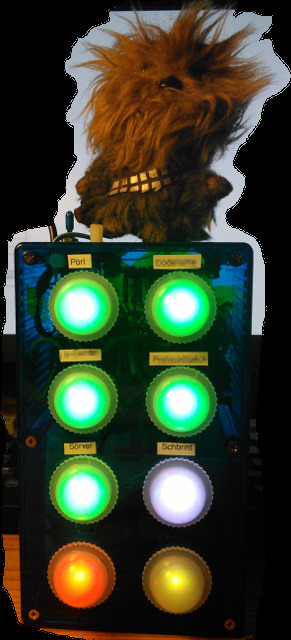
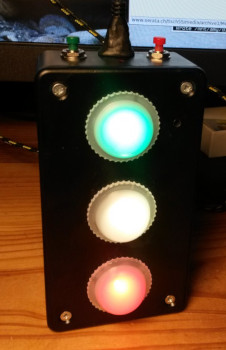
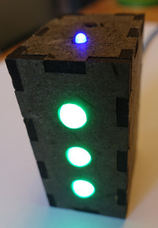
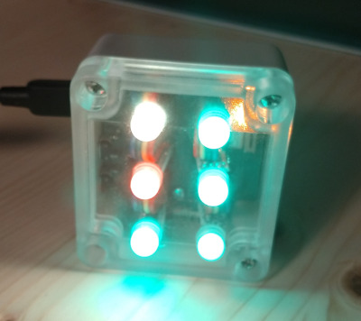

# Tschenggins Lämpli (ESP8266/EPS32 IoT Jenkins CI Lights/Beacon/Build Status Indicator)

by Philippe Kehl (flipflip at oinkzwurgl dot org),
https://oinkzwurgl.org/projaeggd/tschenggins-laempli







## Introduction

This is a Jenkins (jobs) status indicator. It uses RGB LEDs to indicate the build status. The colours indicate the
result (success, warning, failure, unknown) and the the LEDs pulsate while jobs are running. The LEDs start flickering
when the wifi connection is lost or the state and result is otherwise unknown. It can use WS2801 or SK9822/APA102 LEDs.
Chewie roars if something goes wrong (red, failure) and he whistles the Indiana Jones theme when things go back to green
(success) again. The "Hello" version shows only one job's state and result. When the job is running, the light rotates
(a bit like a lighthouse). Obviously, Hello would miaow  and the other Lämplis would play the Imperial March when a job
failed.

The setup for watching the Jenkins jobs status is slightly different from many other similar projects. Instead of
accessing the Jenkins (API) directly from the client, it connects to a custom backend to obtain the current status and
changes of the status of the jobs.

The backend is a simple CGI script (in Perl, of course ;-). The status updates work almost real-time by pushing the
information to the client (the Lämpli) withouth special stuff, such as web sockets or the like. It "abuses" HTTP by
running the CGI script endlessly (or as long as the web server or the connectivity allows). The script keeps sending
data to the client (hearbeats, status updates), which should keep things going for hours in most setups (incl. many
shared hosting services).

In parallel, a second scripts runs on the Jenkins server. It watches the Jenkins jobs for changes in the status and
pushes those to the webserver (where the CGI script is watching for changes to the data). The data is kept in a
single-file "database" (a JSON file). The watcher script does not use the Jenkins API either, but instead watches the
job's output directories for changes. This allows for the near real-time status updates (as opposed to polling the
Jenkins API every now and then).

This also allows making things work in a setup where the (client) wireless network is separate from the (Jenkins) server
network. For example in a company the wireless network may only allow public internet access and the client would not be
able to connect to the Jenkins server directly. And running a VPN client on the ESP8266 or ESP32 would be challenging,
or impossible. In this case the backend can live in the internet, which is reachable from the wireless and the server
networks.

The backend should be a https server. The software (wifi.c) could be modified easily to allow for http. It won't really
verify the certificate (I think), but checking the certificate fingerprint could be added.

See _Backend server concept_ below for details.

This version of the Tschenggins Lämpli software is built using the [Arduino](https://www.arduino.cc/) framework for
either ESP8266 or ESP32 boards. It should be easy to adjust the configuration for the various such boards available at
the usual places. Probably other wifi enabled Arduino compatible boards could be made to work with some effort. Note
that two older and different versions of this software are available in the  [gitta](https://github.com/phkehl/gitta)
and [tschenggins-laempli](https://github.com/phkehl/tschenggins-laempli) repositories. This version is in the
[TschengginsLaempli](https://github.com/phkehl/TschengginsLaempli) repository.

See https://oinkzwurgl.org/projeaggd/tschenggins-laempli for the project documentation.

See the [source code](src/) for copyrights, credits, sources and more.

## Building

Note: This is for Linux. Building this on other systems should work, but is your own problem... :-)

You will need the right Arduino board installed: either [ESP8266 core for Arduino](https://github.com/esp8266/Arduino)
for ESP8266 based boards or [Arduino core for ESP32](https://github.com/espressif/arduino-esp32) for ESP32 based boards.

The following library need to be installed as well: [ArduinoJson](https://arduinojson.org/)

To build the program use the Arduino IDE or the supplied Makefile (which calls the `arduino` binary to verify and upload
the sketch). Config files for [Visual Studio Code](https://code.visualstudio.com/) are provided (with or without the
Arduino extension).

Before building (verifying or uploading the sketch), two steps are required:

First run the script that generates `src/config.h`:

    ./tools/gen_config_h.pl <name>

Where `<name>` is the target name. For each target a file `src/config-<name>.txt` must exist. Some
examples are provided.

Then create a `src/secrets.h` file based on the provided `src/secrets-example.h`. Here you can set the names (SSID) and
password of at least one and up to three wifi networks as well as the URL for the backend server.

If everything went well, either load and verify/upload the `TschengginsLaempli.ino` in the Arduino IDE or use make (say
`make help` for details).

## Debugging

The software produces text debug output on the serial port at baudrate 115200. Use the serial monitor in the Arduino IDE
or the provided `tools/debug.pl` script to display it on the screen. The `debug.pl` script will also colourise the
output.

## Backend server setup

- Install the `tools/tschenggins-status.pl` as a CGI script on some web server. This will need
  `Linux::Inotify2` (to install on Debian: `sudo apt install liblinux-inotify2-perl`).
- Run the `tools/tschenggins-watcher.pl` script on the Jenkins server to monitor the Jenkins jobs
  and point it to the location of the CGI script.


## Hardware setup

### ESP8266

```
+-----------------------+                         O = pins also available on Wemos D1 mini and clones
|                       |                         * = boot mode related:
|      ..antenna..      |                             GPIO15/D8 must be low
|                       |                             GPIO2/D4 must be high
O A0        **GPIO16 D0 o--(WAKE)--                   GPIO0/D3 selects boot mode (high=run, low=flash)
|                       |
o G            GPIO5 D1 O--(out)--> sound effect (Chewie, Hello) (1)
|                       |
o VU           GPIO4 D2 O--(out)--> speaker (2)
|                       |
o S3          *GPIO0 D3 O<--(in)--- built-in flash button (3)
|                       |
o S2          *GPIO2 D4 O--(out)--> built-in blue LED (4)
|                       |
o S1      LoLin     3V0 o                          ** = sleep mode related:
|        NodeMCU        |                               GPIO16/D0 must be connected to RST
o SC      ESP12     GND o                               so that it can reset the system at wakeup time
|                       |
o SO          GPIO14 D5 O--(out)--(HSCLK)--> WS2801 CI (clock in)  \
|                       |                                          |
o SK          GPIO12 D6 O<--(in)--(HMISO)--- not connected         |
|                       |                                           > HSPI (5)
o G           GPIO13 D7 O--(out)--(HMOSI)--> WS2801 DI (data in)   |
|                       |                                          |
o 3V         *GPIO15 D8 O--(out)--(HCS)----> not connected         /
|                       |
o EN           GPIO3 RX O<--(in)--(RXD0)---- not connected  \
|                       |                                    > UART0
O RST          GPIO1 TX O--(out)--(TXD0)---> debug tx (6)   /
|                       |
o GND               GND o
|                       |
o VIN               3V0 o
|          USB          |
+---------/===\---------+
```

* (1) connected to Chewbacca sound module, pulled low for a moment to trigger the roaring
* (2) connected to (piezo or other small) speaker, used for outputting tones and melodies
* (3) connected to the flash button on the NodeMCU board
* (4) connected to the LED on the ESP12 module (it seems),used for status indication, inverted, the LED is lit when GPIO2/D4 is low
* (5) only CLK and MOSI are connected to the WS2801 chain, but MOSI and CS are also configured
      (it's unclear if that is required or the pins could be used for something else)
* (6) connected to the CH304G USB to UART chip, for debug output

### ESP32

The "gitta" board. Note: this is a privately developed board. Unfortunately it's a broken design and hence there are no board files or even made boards available. I might fix that at some point.

```
The numbers are:      +--------------------------------+           o = input/output
ESP32 GPIO (NINA pin) |     +--------+                 |           x = input only
                      |  26-|        |                 |           s = power supply, ground
                +-----+ (17)|  NINA  |                 +-----+
                |       /   |  W102  |                       |
            GND | s---LED   |        |                     s | 3V3
        (16) 25 | o         +--------+                     o | 21 (8)
        (20) 22 | o                                        o | 33 (7)
            3V3 | s                                        o | 32 (5)
            GND | s                                        x | 36 (4)
        (21) 19 | o DI                 27 (18)             x | 39 (3)
        (29) 18 | o CI     1 (22) TX      \ ___            x | 34 (2)
        (24)  4 | o        3 (23) RX       /   \           o | 23 (1)
        (25)  2 | o boot    +---+         | buz |          s | 3V3
        (36) 12 | o         | F |          \___/           o | 14 (31)
        (35) 13 | o         | T |          /               o | 15 (32)
        (34) 35 | x         | D |       GND                o |  5 (28)
                |           | I |                            |
                +-----+     +---+        (19)   0 (27) +-----+
                      |      /          reset    boot  |
                      |    USB           SW 1    SW 2  |     TODO: FTDI RTS+DRT connections
                      +--|_____|--------|____|--|____|-+
                                          ||      ||
```

Available GPIOs: 2 4 5 12 13 14 15 18 19 21 22 23 25 32 33, missing: 16 17

## Some notes

* ESP8266 Ardiono docu: https://arduino-esp8266.readthedocs.io/en/latest/reference.html
* ESP32 Ardiono docu: doesn't really exist
* Maybe again add a web interface for configuration?
  * https://github.com/tzapu/WiFiManager perhaps?
  * Double-reset detection to clear settings.
* ArduinoJson memory calculator: https://arduinojson.org/v6/assistant/
* VSCode Arduino extension: https://marketplace.visualstudio.com/items?itemName=vsciot-vscode.vscode-arduino
* Maybe https://github.com/FastLED/FastLED could be useful?
* More things could go to PROGMEM perhaps.
* Arduino command line hard to find docu: https://github.com/arduino/Arduino/blob/master/build/shared/manpage.adoc
** Trick: build in VSCode and then look at command line in `ps fauwx` while it's running.
** More interesting stuff: https://github.com/arduino/Arduino/wiki
* Create Arduino board files instead of config-*.txt?

